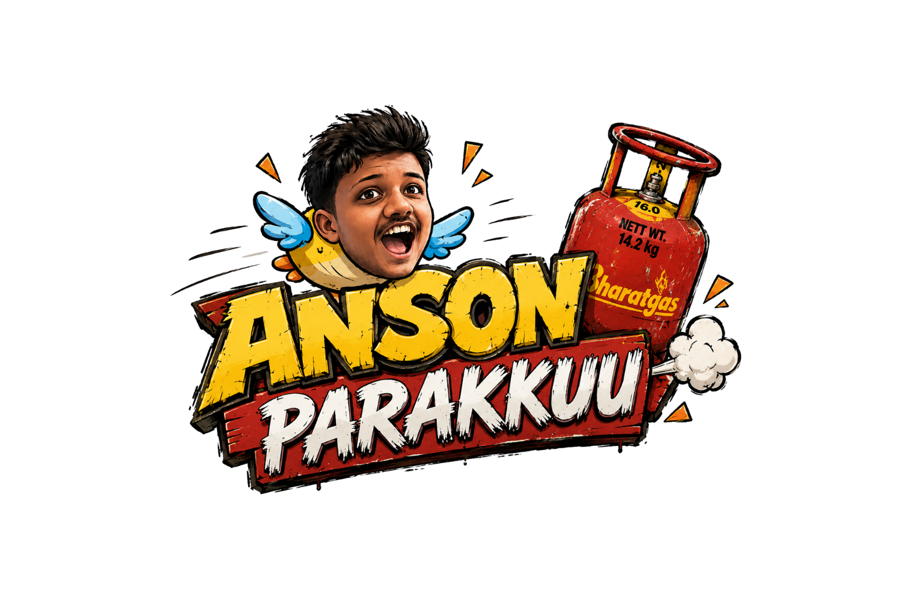

<h1 align="center">
  
</h1>

<p align="center">
  <i>A chaotic flight. A tragic pilot. A gas cylinder destiny.</i>
</p>

<p align="center">
  
</p>

---

<p align="center">
  
</p>

---

## EXPERIENCE

<p align="center">
  
</p>

A fast-paced arcade game inspired by Flappy Bird —  
but with **Anson as the pilot** and **gas cylinders as obstacles**.

Every run ends in:
- chaos  
- regret  
- pure comedy  

---

## CORE FEATURES

<p align="center">

| Feature | Description |
|--------|------------|
| Custom Character | Real face + animated bird |
| Dynamic Obstacles | Stacked gas towers |
| Physics System | Smooth + skill-based |
| Funny Death System | Manglish roast engine |
| Controls | Tap / Space |
| Gameplay | Endless |

</p>

---

## GAMEPLAY PREVIEW

<p align="center">
  
</p>

---

## CONTROLS

```txt
MOBILE   → TAP
PC       → SPACE
OBJECTIVE→ SURVIVE CYLINDERS
